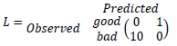

```{r setup, include=FALSE}
#### -----------------------------------------
####                Setup
#### -----------------------------------------
knitr::opts_chunk$set(echo = TRUE)
knitr::opts_knit$set(root.dir = "C:/Users/valen/OneDrive/Documents/Sem01/P02/Machine_Learning/Assignments/ML_B1_A2")
RNGversion("3.5.1")
library(readxl)
library(tree)
library(ggplot2)
library(e1071)
library(boot)
library(fastICA)
library(MASS)
set.seed(12345)

# util function
get_performance <- function(targets, predictions, text) {
    cat("Classification Performance :", text, "\n")
    t <- table(targets, predictions)
    print("Confusion Matrix")
    print(t)
    tn <- t[1,1]
    tp <- t[2,2]
    fp <- t[1,2]
    fn <- t[2,1]
    total <- length(predictions)
    tpr <- tp/(tp+fp) * 100
    tnr <- tn/(tn+fn) * 100
    fpr <- fp/(tp+fp) * 100
    fnr <- fn/(tn+fn) * 100
    
    cat("Rates details:\n")
    cat(" TPR =", tpr, "% -")
    cat(" TNR =", tnr, "% -")
    cat(" FPR =", fpr, "% -")
    cat(" FNR =", fnr, "%")
    cat("\n Misclassification Rate = ", (fp+fn)/total * 100, "%\n")
}
```
# Assignment 1. LDA and logistic regression
The data file australian-crabs.csv contains measurements of various crabs, such as frontal lobe, rear width and others. 

1. Use australian-crabs.csv and make a scatterplot of carapace length (CL) versus rear width (RW) where observations are colored by sex. Do you think that this data is easy to classify by linear discriminant analysis? Motivate your answer.

Plotting the data

```{r crab1, out.height='40%', fig.align='center'}
data <- read.csv2("data/australian-crabs.csv", sep = ",", dec=".")
males <- data[which(data$sex == "Male"),]
females <- data[which(data$sex == "Female"),]
ggplot() + ggtitle("Carapace length vs Rear width by sex") +
    geom_point(aes(y = females$CL, x = females$RW, color = "Females")) +
    geom_point(aes(y = males$CL, x = males$RW, color = "Males")) +
    xlab("Rear Width") + ylab("Carapace Length") 
```

The classes are overlapped that indicates that linear classification is not easy.
Since LDA maximize the separability between classes it might be a good choice to perform it in order to get a better scenario to classify these classes.

2. Make LDA analysis with target Sex and features CL and RW and propostional prior by using ```lda()``` function in package ```MASS```. Make a scatterplot of CL versus RW colored by the predicted Sex and compare it with the plot in step 1. Compute the misclassification error and comment on the quality of fit. 

```{r, out.height='40%', fig.align='center'}
ldaModel <- lda( sex ~ RW + CL, data = data)
predictions <- predict(ldaModel, data)
predictedData <- data.frame(
  sex <- predictions$class,
  CL <- data$CL,
  RW <- data$RW
)
ggplot() + ggtitle("Sex Classification using LDA : Sex ~ RW + CL") +
    geom_point(aes(y = predictedData[which(sex == "Female"), ]$CL, 
                   x = predictedData[which(sex == "Female"), ]$RW, 
                   color = "Females")) +
    geom_point(aes(y = predictedData[which(sex == "Male"), ]$CL, 
                   x = predictedData[which(sex == "Male"), ]$RW, 
                   color = "Males")) +
    xlab("Rear Width") + ylab("Carapace Length") 
get_performance(data$sex, predictions$class, "Sex classification using LDA")
```

Now it can be seen that no classes are overlapped which means that, as it has been computed, there is 3.5% of misclassification error.


3. Repeat step 2 but use priors $p(Male) = 0.9$ and $p(Female) = 0.1$ instead. How did the classification result change and why?


```{r, out.height='40%', fig.align='center'}
ldaModel <- lda( sex ~ RW + CL, data = data, prior = c(0.1, 0.9))
predictions <- predict(ldaModel, data)
predictedData <- data.frame(
  sex <- predictions$class,
  CL <- data$CL,
  RW <- data$RW
)
ggplot() + ggtitle("Sex Classification using LDA : Sex ~ RW + CL | M=90%, F=10%") +
    geom_point(aes(y = predictedData[which(sex == "Female"), ]$CL, 
                   x = predictedData[which(sex == "Female"), ]$RW, 
                   color = "Females")) +
    geom_point(aes(y = predictedData[which(sex == "Male"), ]$CL, 
                   x = predictedData[which(sex == "Male"), ]$RW, 
                   color = "Males")) +
    xlab("Rear Width") + ylab("Carapace Length") 
get_performance(data$sex, predictions$class, "Sex classification using LDA")
```

Now the classification, as the proportion is 9 to 1 for males, is likely to classify samples as males. This can be seen in the difficult to classify ones, in which most of them have been classified as males which has increased the misclassification erro to 8%. 

4. Make a similar kind of classification by logistic regression (use function ```glm()```), plot the classified data and compute the misclassification error. Compare there results with the LDA results. Finally, report the equation of the decision boundary and draw the decision boundary in the plot of the classified data. 

```{r, out.height='40%', fig.align='center'}
logRegModel <- glm(sex ~ RW + CL, data = data, family = "binomial")
logRegResponse <- predict(logRegModel, data=data, type="response")
logRegResponse <- as.numeric(logRegResponse > .5)
logRegPredictions <- factor(logRegResponse, levels=c(0,1), labels=c("Female","Male"))
get_performance(data$sex, logRegPredictions, "Logistic regression classification")

predMalesIdx <- which(logRegPredictions == "Male")
predMales <- data[predMalesIdx,]
predFemales <- data[-predMalesIdx,]

coeff <- coefficients(logRegModel)
coeff
bias <- coeff[1]
RW <- coeff[2]
CL <- coeff[3]

p <- ggplot() + ggtitle("Logistic regression classification") +
  geom_point(aes(x=predMales$RW, y=predMales$CL, color="Males")) +
  geom_point(aes(x=predFemales$RW, y=predFemales$CL, color="Females")) +
  xlab("Rear Width") + ylab("Carapace Length")

#xmin <- p$plot_env$xmin
#xmax <- p$plot_env$xmax
xmin <- 6.7
xmax <- 20.2

x <- seq(from = xmin, to = xmax, by = .1)
y <- vector(length=length(x))
y <- (bias + RW * x) / (-1 * CL)

p <- p + geom_line(aes(x=x, y=y, color="Model"))
p
```

Given the obtained coefficients, the boundary equation is the following: 

$$y = - \frac{13.616628 + -12.563893 x}{4.630747} $$

# Assignment 2. Analysis of credit scoring

The data file creditscoring.xls contains data retrieved from a database in a private enterprise. Each row contains information about one customer. The variable good/bad indicates how the customers have managed their loans. The other features are potential predictors. Your task is to derive a prediction model that can be used to predict whether or not a new customer is likely to pay back the loan.


1. Import the data to R and divide into training/validation/test as 50/25/25: use data partitioning code specified in Lecture 1e.

```{r q2_split_data }


#### -----------------------------------------
####                Question 2
#### -----------------------------------------


## 2.1 Split data

data <- read_xls("data/creditscoring.xls")
n <- dim(data)[1]
data$good_bad <- as.factor(data$good_bad)

# training set
id <- sample(1:n, floor(n*0.5))
train <- data[id,]

# validation set
id1 <- setdiff(1:n, id)
id2 <- sample(id1, floor(n*0.25))
valid <- data[id2,]

# test set
id3 <- setdiff(id1,id2)
test <- data[id3,]

cat("Data set size \t\t:", dim(data))
cat("Training set size \t:", dim(train))
cat("Validation set size \t:", dim(valid))
cat("Testing set size \t:", dim(test))
```

2. Fit a decision tree to the training data by using the following measures of impurity and report the misclassification rates for the training and test data. Choose the measure providing the better results for the following steps.

```{r q2_tree_main}

## 2.2 Trees 

f <- good_bad ~ .


```

a. Deviance

```{r q2_tree_deviance,  out.height='30%', fig.align='center'}


### 1.2.a Deviance Tree
devTree <- tree(formula = f, data = train, split = "deviance")
plot(devTree)
text(devTree)
#summary(devTree)

true <- test$good_bad
predictions <- predict(devTree, newdata = test, type = "class")
get_performance(true, predictions, "Tree. split = deviance")

```


b. Gini index

```{r q2_tree_gini, echo=FALSE, fig.align='center'}


### 1.2.b Gini Index
giniTree <- tree(formula = f, data = train, split = "gini")
plot(giniTree)
#text(giniTree)
#summary(giniTree)

predictions <- predict(giniTree, newdata = test, type = "class")
get_performance(true, predictions, "Tree. split = gini")
```

In summary, the tree trained using deviance as split method performs better than the one using Gini Index given its misclassification rate and its true positives rate. Also, the one with deviance is considerably smaller than the Gini one, this size difference might show some grade of overfitting in the later.


3. Use training and validation sets to choose the optimal tree depth. Present the graphs of the dependence of deviances for the training and the validation data on the number of leaves. Report the optimal tree, report it’s depth and the variables used by the tree. Interpret the information provided by the tree structure. Estimate the misclassification rate for the test data.

Crossvalidating the deviance-trained tree:

```{r q2_devtree_optimal_depth, warning=FALSE, out.height='40%', fig.align='center'}

### 2.3 Optimal depth by train/validation

analyzeOptTreeDepth <- function(atree, maxDepth, newdata) {
    trainScore <- rep(0,maxDepth)
    testScore <- rep(0,maxDepth)
    depth <- 2:maxDepth
    
    for (i in depth) {
        prunedTree <- prune.tree(atree, best=i)
        predictions <- predict(prunedTree, newdata=newdata, type="tree")
        trainScore[i] <- deviance(prunedTree)
        testScore[i] <- deviance(predictions)
    }
    trainScore <- trainScore[depth]
    testScore <- testScore[depth]
    df <- data.frame(
        train = trainScore,
        test = testScore, 
        depth = depth
    )   
    optDev <- min(testScore)
    optimal <- depth[which.min(testScore)]
    return ( list (
            df = df, 
            optimalDeviance = optDev,
            optimalDepth = optimal
        )
    )
}

maxDepth <- 12
results <- analyzeOptTreeDepth(devTree, maxDepth, valid)
p <- ggplot(data=results$df) + 
    geom_line(aes(x = depth, y=train, color="Training")) +
    geom_line(aes(x = depth, y=test, color="Validation")) +
    geom_point(aes(x = depth, y=train, color="Training")) +
    geom_point(aes(x = depth, y=test, color="Validation")) +
    scale_x_continuous(breaks = results$df$depth) +
    scale_y_continuous(breaks = seq(250, 650, by=50)) +
    ylab("Deviance") + xlab("Depth") + ggtitle("Optimal Tree Crossvalidation Scores") 
p

cat("The optimal tree is at depth", results$optimalDepth, "with deviance", results$optimalDeviance)

```

In the graph above it is shown the deviances scores obtained by pruned trees for the given depths for both, training and testing data. Considering testing data as the one in which the selection decision has to been based on, it can be seen that the optimal depth is 4 in which the lowest deviance is obtained (282.7)

Said that, the optimal tree is the following: 

```{r q2_optimal_tree, warning=FALSE, out.height='30%', fig.align='center'}
devTree <- tree(formula = f, data = train, split = "deviance")
optTree <- prune.tree(devTree, best = results$optimalDepth)
plot(optTree)
text(optTree)
```

For which the performance under testing data is: 

```{r q2_optimal_tree_performance, warning=FALSE, out.height='30%', fig.align='center'}
predictions <- predict(optTree, newdata = test, type = "class")
get_performance(test$good_bad, predictions, "Optimal Tree - test data")
```


4. Use training data to perform classification using Naïve Bayes and report the confusion matrices and misclassification rates for the training and for the test data. Compare the results with those from step 3.


```{r q2_naive_bayes, warning=FALSE}

### 2.3 Optimal depth by train/validation
nb <- naiveBayes(f, data=train)

nbTrainPred <- predict(nb, newdata=train)
get_performance(train$good_bad, nbTrainPred, "Naive Bayes - Train")
nbTestPred <- predict(nb, newdata=test)
get_performance(test$good_bad, nbTestPred, "Naive Bayes - test")

```

Although tree classifier seems to perform better given that it gets the lowest misclassification rate under testig data, Naïve Bayes classifier gets better True Positives rate, which, depending on the application of the predictor, might be more desireable than the other.

For this particular application in which it is desired to get the loans paid, misclasification could be considered more important, so Tree classifier is chosen to be deployed.

Overall, none of two outstands in their performance.

5. Use the optimal tree and the Naïve Bayes model to classify the test data by using the following principle: $\hat{Y} = 1$ if $p(Y=good|X) > \pi$, otherwise $\hat{Y}=0$ where $\pi = 0.05, 0.1, 0.15, ..., 0.9, 0.95$. Compute the TPR and FPR values for the two models and plot the corresponding ROC curves. Conclusion?

Using the given thresholds the following ROC are obtained:

```{r q2_roc_curves, warning=FALSE, out.height='40%', fig.align='center'}
nbTestPred <- predict(nb, newdata=test, type="raw")
otTestPred <- predict(optTree, newdata=test, type="vector")
nbTestPred <- nbTestPred[,"good"]
otTestPred <- otTestPred[,"good"]

totalNegative <- sum(test$good_bad == "bad")
totalPositive <- sum(test$good_bad == "good")
thresholds <- seq(.05, .95, .05)
nbFP = vector(length = length(thresholds))
nbTP = vector(length = length(thresholds))
otFP = vector(length = length(thresholds))
otTP = vector(length = length(thresholds))

for(i in 1:length(thresholds)) {
    # Naive Bayes
    nbPred <- as.numeric(nbTestPred > thresholds[i])
    nbPredFactor <- factor(x = nbPred, levels = c(0,1), labels=c("bad", "good"))
    nbTable <- table(test$good_bad, nbPredFactor)
    nbFP[i] <- nbTable[1,2]
    nbTP[i] <- nbTable[2,2]

    # Optimal Tree
    otPred <- as.numeric(otTestPred > thresholds[i])
    otPredFactor <- factor(x = otPred, levels = c(0,1), labels=c("bad", "good"))
    otTable <- table(test$good_bad, otPredFactor)
    otFP[i] <- otTable[1,2]
    otTP[i] <- otTable[2,2]
}

nbFPR <- nbFP/totalNegative
nbTPR <- nbTP/totalPositive
otFPR <- otFP/totalNegative
otTPR <- otTP/totalPositive

p <- ggplot()
p <- p + geom_line(aes(x=nbFPR, y=nbTPR, color="Naive Bayes"))
p <- p + geom_line(aes(x=otFPR, y=otTPR, color="Optimal Tree"))
p <- p + geom_line(aes(x=otFPR, y=otFPR, color="TPR=FPR"))
p <- p + ylab("TPR") + xlab("FPR") + ggtitle("ROCs")
p

```


The blue line represents where the false positive rate is equal than the true positive rates. As it has been said in the previous question, though Naïve Bayes seems to show worse misclassification rates, it tends to get better results regarding true positives and that can be seen on the ROC curve. At higher thresholds Naîve Bayes seems to perform better than the tree classifier. 

6. Repeat Naïve Bayes classification as it was in step 4 but use the following loss matrix. 

```{r include_matrix_fig, fig.align='center', out.height = '10%'}

```

and report the confusion matrix for the training and test data. Compare the results with the results from step 4 and discuss how the rates have changed and why.

```{r q2_6 }
lossMatrix <- matrix(c(0,10,1,0), ncol=2)
print("Loss Matrix")
lossMatrix

# Getting a new clean naive bayes classifier
nbClass <- naiveBayes(good_bad ~ . , data = train)
nbTrainPred <- predict(nbClass, newdata=train, type="raw")
nbRuleBasedPred <- nbTrainPred[,1]/nbTrainPred[,2] 
nbRuleBasedPred <- as.numeric(nbRuleBasedPred > lossMatrix[2,1]/lossMatrix[1,2])
nbRuleBasePred_factor <- factor(x=nbRuleBasedPred, levels = c(1,0), labels=c("good", "bad"))
get_performance(train$good_bad, nbRuleBasePred_factor, "Naive Bayes new rule - Training")

# Same for training data
nbTestPred <- predict(nbClass, newdata=test, type="raw")
nbRuleBasedPred <- nbTestPred[,1]/nbTestPred[,2] 
nbRuleBasedPred <- as.numeric(nbRuleBasedPred > lossMatrix[2,1]/lossMatrix[1,2])
nbRuleBasePred_factor <- factor(x=nbRuleBasedPred, levels = c(1,0), labels=c("good", "bad"))
get_performance(test$good_bad, nbRuleBasePred_factor, "Naive Bayes new rule - Test")
```

The new loss matrix penalizes ten times more the false positives, then misclassification rates are lower than before.

# Assignment 3 : Uncertainty estimation

The data file State.csv contains per capita state and local public expenditures and associated state demographic and economic characteristics, 1960, and there are variables

- MET: Percentage of population living in standard metropolitan areas
- EX: Per capita state and local public expenditures ($)

1. Reorder your data with respect to the increase of MET and plot EX versus MET. Discuss what kind of model can be appropriate here. Use the reordered data in steps 2-5.

```{r q3_reorder}


#### -----------------------------------------
####                Question 3
#### -----------------------------------------


data <- read.csv2("data/State.csv")
data <- data[order(data$EX),]
```

2. Use package tree and fit a regression tree model with target EX and feature MET in which the number of the leaves is selected by cross-validation, use the entire data set and set minimum number of observations in a leaf equal to 8 (setting minsize in tree.control). Report the selected tree. Plot the original and the fitted data and histogram of residuals. Comment on the distribution of the residuals and the quality of the fit.

```{r q3_tree_train, warning=FALSE, out.height='40%', fig.align='center'}
regTree <- tree(formula = EX ~ MET,  
                data = data,  
                control = tree.control(nobs = length(data$EX), minsize = 8)
            )

maxDepth <- 12
results <- analyzeOptTreeDepth(regTree, maxDepth, data)
plot(regTree)
text(regTree)
```

Finding the optimal tree using crossvalidation:

```{r q3_tree_plot, warning=FALSE, out.height='40%', fig.align='center'}
cv.regTree <- cv.tree(regTree)
plot(cv.regTree$size, cv.regTree$dev, type="b", col="red")
```


It can be observed that the optimal tree performance is at size=3. Pruning the tree to fit that it is obtained the following tree:


```{r q3_tree_prune, fig.align='center', message=FALSE, warning=FALSE, out.height='30%'}
optTree <- prune.tree(regTree, best = 3)
plot(optTree)
text(optTree)
```

Comparing the predictions made by the optimal tree against the actual data:

```{r q3_tree_predictions, fig.align='center', message=FALSE, warning=FALSE, out.height='40%'}
predictions <- predict(optTree, newdata = data)
p <- ggplot()
p <- p + geom_point(aes(x=data$MET, y=data$EX, color="real"))
p <- p + geom_point(aes(x=data$MET, y=predictions, color="predicted"))
p <- p + ylab("EX") + xlab("EM") + ggtitle("Regression Tree")
p
```

And analyzing the residuals for the shown predictions:

```{r q3_tree_residuals, fig.align='center', message=FALSE, warning=FALSE, out.height='40%'}
residuals <- data$EX - predictions
h <- ggplot(as.data.frame(residuals), aes(x=residuals))
h <- h + geom_histogram(bins = 15)
h <- h + ggtitle("Residuals Histogram")
h

cat("Residuals mean:", mean(residuals), "\n")
cat("Residuals variance:", var(residuals), "\n")
```

While visualy analizing the residuals it seems to follow a bell curve skewed to the right, though when checking the statistics from them it can be seen that its mean is close to zero and have a huge variance. Given the little amount of data it is not simple to argue a certain distribution, so it is recommended to assume a Gaussian distribution with mean zero.


3. Compute and plot the 95% confidence bands for the regression tree model from step 2 (fit a regression tree with the same settings and the same number of leaves as in step 2 to the resampled data) by using a non-parametric bootstrap. Comment whether the band is smooth or bumpy and try to explain why. Consider the width of the confidence band and comment whether results of the regression model in step 2 seem to be reliable.

```{r q3_nonparam_bootstrap}

doBoot <- function(data, ind) {
    data1 <- data[ind,]
    fit <- tree(EX~MET,
                data=data1,
                control = tree.control(minsize = 8,nobs = nrow(data))
            )
    prunedTree <- prune.tree(fit,best=3)
    pred <- predict(prunedTree,data)
    return(pred)
}

res <- boot(data, doBoot, R=1000)
envlp <- envelope(res, level=0.95)
fit <- tree(EX ~ MET, data=data, 
                control = tree.control(nobs=nrow(data), minsize = 8)
        )
optTree <- prune.tree(fit, best=3)
predictions <- predict(optTree, newdata=data)

df <- data.frame(
    MET = data$MET,
    EX = data$EX,
    predictions = predictions,
    upBound = envlp$point[1,],
    lowBound = envlp$point[2,]
)

p <- ggplot(data = df)
p <- p + geom_ribbon(aes(x=MET, ymax=upBound, ymin=lowBound), alpha=0.5)
p <- p + geom_point(aes(x=MET, y=EX, color="real"))
p <- p + geom_line(aes(x=MET, y=predictions, color="predicted"))
p <- p + geom_point(aes(x=MET, y=predictions, color="predicted"))
p <- p + ylab("EX") + xlab("EM") + ggtitle("Regression Tree - 95% confidence")
p <- p + scale_y_continuous(breaks = seq(0, 600, by=20))
p

```

In the plot it can be seen that there is a non-minor amount of observations outside the confidence region.

4. Compute and plot the 95% confidence and prediction bands the regression tree model from step 2 (fit a regression tree with the same settings and the same number of leaves as in step 2 to the resampled data) by using a parametric bootstrap, assume $Y ~ N(\mu_i, \sigma^2)$ where $\mu_i$ are labels in the tree leaves and $\sigma^2$ is the residual variance. Consider the width of the confidence band and comment whether results of the regression model in step 2 seem to be reliable. Does it look like only 5% of data are outside the prediction band? Should it be?


```{r}
regTree <- tree(formula = EX ~ MET,
                data = data,
                control = tree.control(nobs = nrow(data), minsize = 8)
            )
mle <- prune.tree(regTree, best = 3)

rng <- function(data, mle){
  data1 <- data.frame(EX=data$EX, MET=data$MET)
  data1$EX <- rnorm( length(data1$EX), predict(mle,data1), sd=sd(residuals(mle)))
  return(data1)
}

f <- function(data1){
  tree <- tree(EX~MET, 
               data=data1, 
               control = tree.control(minsize = 8,nobs = nrow(data))
            )
  pTree <- prune.tree(tree, best=3)
  pred <- predict(pTree, data)
  pred <- rnorm(length(pred),
                mean=pred,
                sd=sd(residuals(mle))
        )
  return(pred)
}

boot_res1 <- boot(data,
                  statistic = f,
                  R = 1000,
                  mle = mle,
                  ran.gen = rng,
                  sim = "parametric"
            )

enlvp <- envelope(boot_res1, level = 0.95)

tMod <- tree(EX~MET,
                 data=data,
                 control = tree.control(minsize = 8,nobs = nrow(data))
            )
prunedTree <- prune.tree(tMod, best=3) 
pred <- predict(prunedTree, data)

df <- data.frame(
    EX = data$EX,
    MET = data$MET,
    upBound = envlp$point[1,],
    lowBound = envlp$point[2,],
    pred = pred
)

p <- ggplot(data = df)
p <- p + geom_ribbon(aes(x=MET, ymax=upBound, ymin=lowBound), alpha=0.5)
p <- p + geom_point(aes(x=MET, y=EX, color="real"))
p <- p + geom_line(aes(x=MET, y=predictions, color="predicted"))
p <- p + geom_point(aes(x=MET, y=predictions, color="predicted"))
p <- p + ylab("EX") + xlab("EM") + ggtitle("Regression Tree - Non-param Bootstrap")
p <- p + scale_y_continuous(breaks = seq(0, 600, by=20))
p
```


5. Consider the histogram of residuals from step 2 and suggest what kind of bootstrap is actually more appropriate here.e

If we assume the residuals follow a normal distribution, then Parametric bootstrap is more suitable.


# Assignment 4 - Principal components


The data file NIRspectra.csv contains near-infrared spectra and viscosity levels for a collection of diesel fuels. Your task is to investigate how the measured spectra can be used to predict the viscosity.

```{r q4_init, message=FALSE, warning=FALSE}
data <- read.csv2("data/NIRSpectra.csv")
data <- data[,-ncol(data)]
```

1. Conduct a standard PCA by using the feature space and provide a plot explaining how much variation is explained by each feature. Does the plot show how many PC should be extracted? Select the minimal number of components explaining at least 99% of the total variance. Provide also a plot of the scores in the coordinates (PC1, PC2). Are there unusual diesel fuels according to this plot?

According to the following plot very few Principal Components explain most of the variance, which implies that the data set dimension could be reduced from over a hundred to just a few variables. 

```{r q4_PCA_explained_var, fig.align='center', message=FALSE, warning=FALSE, out.height='40%'}
# 4.1 - PCA
res <- prcomp(data) 
lambda <- res$sdev^2
prop <- lambda/sum(lambda) * 100
prop <- prop[order(prop, decreasing = TRUE)]
ggplot() + geom_point(aes(x=1:length(prop), y=prop)) +
    ggtitle("Variance Explained by Principal Components") +
    xlab("Principal Components") + ylab("Explained Variance [%]") +
    scale_y_continuous(breaks = seq(0, 110, by=10))
```


The printout below (close to zero values have been omitted) confirms that, after sorting their contributions, just the two first PCs represent 99.6% of the total variance. So the dimensionality could be reduced from 127 dimensions to just two.

```{r q4_PCA_text}
print("Principal Components Contributions")
sprintf("%2.3f", prop[1:16])
```

The following plot show how the data is explained when the dimensionality is reduced to two principal components out of 127. Since these two new features are a linear combination of the 127 original characteristics, it looses interpretability, though for computational purposes it implies a good improvement. It can be seen some anormalities along the PC1

```{r q3_PCA_pc1vspc2, fig.align='center', message=FALSE, warning=FALSE, out.height='40%'}
ggplot() + geom_point( aes(x=res$x[,1], y=res$x[,2]) ) +
    ggtitle("Scores - PC1 vs PC2") +
    xlab("PC1") + ylab("PC2")

```

2. Make trace plots of the loadings of the components selected in step 1. Is there any principle component that is explained by mainly a few original features?

```{r q4_PCA_traceplots, fig.align='center', message=FALSE, warning=FALSE, out.height='40%'}

# 4.2 - PCA Trace plots
U <- res$rotation
x <- 1:nrow(res$rotation)
ggplot() + geom_point(aes(x=x, y=U[,1])) + ggtitle("PCA - Traceplot PC1") +
    xlab("Index") + ylab("Load")
ggplot() + geom_point(aes(x=x, y=U[,2])) + ggtitle("PCA - Traceplot PC2") + 
    xlab("Index") + ylab("Load") 
```


It can be seen that the two components are comprised by a linear combination of all the original variables. Although for the first component, the contributions come mainly for the first variables, and in the second the opposite, no weight represents more than a half of all the weights, thus it cannot be said that there is a principal component being represented mainly by one in the original space. 

 3. Perform Independent Component Analysis with the number of components selected in step 1 (set seed 12345). Check the documentation for the fastICA method in R and do the following:

 a. Compute $W' = K \cdot W$ and present the columns of  $W'$ in form of the trace plots. Compare with the trace plots in step 2 and make conclusions. What kind of measure is represented by the matrix $W'$?

$W$ matrix contains the unmixing coefficients. It can be seen that the traceplots from it are somewhat similar but in a mirrored fashion. This will allow to \emph{undo} the compression and get an approximation of the original variables before PCA.

```{r q4_3a_fastica, fig.align='center', message=FALSE, warning=FALSE, out.height='40%'}

# 4.3.a - Fast ICA
ica <- fastICA(X = data, n.comp = 2, alg.typ = "parallel")
W_ <- ica$K %*% ica$W
ggplot() + geom_point(aes(x=x, y=W_[,1])) + ggtitle("ICA - Traceplot PC1") +
    xlab("Index") + ylab("W'")
ggplot() + geom_point(aes(x=x, y=W_[,2])) + ggtitle("ICA - Traceplot PC2") +
    xlab("Index") + ylab("W'")
```


 b. Make a plot of the scores of the first two latent features and compare it with the score plot from step 1.

```{r q4_3b_ica_scores, fig.align='center', message=FALSE, warning=FALSE, out.height='40%'}
# 4.3.b - Scores
ggplot() + geom_point( aes(x=ica$S[,1], y=ica$S[,2]) ) +
    ggtitle("Scores - IC1 vs IC2") +
    xlab("IC1") + ylab("IC2")
```

It can be seen that the scores looks rotated when compared to the PCA scores.


